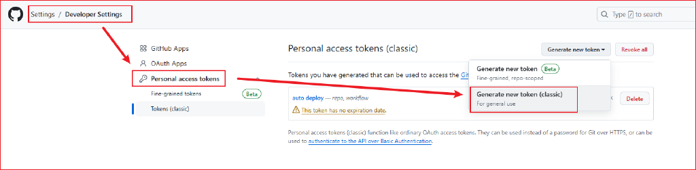
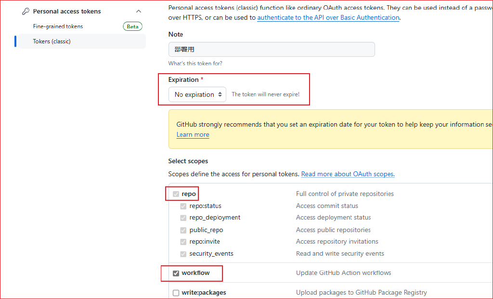
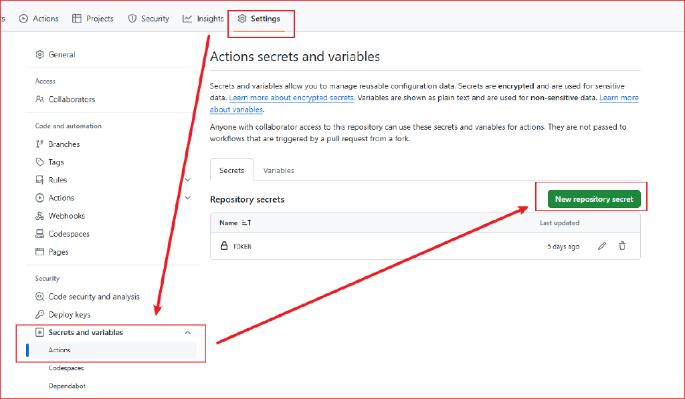

+++
title = '使用Hugo+Github Pages搭建个人博客'
date = 2024-10-15T11:06:58+08:00
description = "本文介绍了如何使用Hugo+Github Pages搭建个人博客"
tags = [
    "Hugo",
    "Blog",
    "Github",
]
categories = [
    "themes",
    "syntax",
]
series = ["Github Guide"]
image = "home.png"

+++

## 下载Hugo和主题

HUGO中文文档地址：[https://hugo.opendocs.io/](https://hugo.opendocs.io/)

Hugo Github地址：[https://github.com/gohugoio/hugo](https://github.com/gohugoio/hugo)

> [!CAUTION]
>
> 这里在下载Hugo的时候需要注意，一定要下载扩展版本的。根据Hugo官网的描述，扩展版使用内置的LibSass转译器，[将Sass转译为CSS](https://hugo.opendocs.io/hugo-pipes/transpile-sass-to-css/)。
>
> 我第一次下载时在Release中下载了不带extended的版本，导致后面添加主题运行报错，提示的错误信息与上面的Sass有关。
>
> 因此一定要下载带extended的扩展版本，[hugo_extended_0.135.0_windows-amd64.zip](https://github.com/gohugoio/hugo/releases/download/v0.135.0/hugo_extended_0.135.0_windows-amd64.zip)

然后是Hugo主题，下载位置在这里[https://themes.gohugo.io/](https://themes.gohugo.io/)，我使用的是Stack主题[hugo-theme-stack Source code(zip)](https://github.com/CaiJimmy/hugo-theme-stack/archive/refs/tags/v3.27.0.zip)。

## 创建和配置Hugo项目

> [!NOTE]
>
> 下载Hugo以后，解压缩后得到.exe可执行文件。为了方便，我在Windows系统环境变量中添加了路径，后续就可以在命令行中直接使用hugo指令。

### 创建Hugo项目

使用以下命令创建新的Hugo项目：

```shell
hugo new site xxxx
```

我这里的xxxx用的是dev

### 运行服务

使用以下命令之一来运行Hugo服务器：

```
hugo server --buildDrafts 
```

或者简写为：

```
hugo server -D
```

### 使用主题

1. 将主题压缩包解压
2. 将解压后的完整文件夹放入Hugo项目目录下的 `themes` 文件夹中
3. 找到 `hugo-theme-stack` 主题文件夹下的 `exampleSite` 文件夹
4. 将 `exampleSite` 中的 `content` 文件夹和 `hugo.yaml` 文件复制到 `dev` 文件夹下
5. 删除 `dev` 文件夹中的 `hugo.toml` 文件

后续主要就是对`hugo.yaml`中的配置项进行修改。

### 新建文章

使用以下命令创建新的Hugo文章：

```
hugo new content post/HowToCreateHugoBlog/index.md
```

这里的`HowToCreateHugoBlog`可以替换为其他的文章名称

## 使用Github Pages部署

> [!NOTE]
>
> 在创建仓库的时候需要注意创建公开仓库，刚开始我创建了私有仓库，后续发现Github Pages始终不出现，修改为公开仓库后成功部署。


1. 创建一个xxx.github.io的公开仓库

2. 前往`Setttings -> Developer Settings -> Personal access tokens`，创建一个token(classic)
    
3. token选择永不过期，并勾选 **repo** 和 **workflow** 选项
    
4. 为保证安全，将生成的token，保存的仓库的变量中，前往`Settings -> Secrets and variables -> Actions`中设置
    
5. 在hugo主文件创建一个`.github/workflows/xxxx.yaml`文件，将以下内容复制进去，想具体了解更多，可查看【[Github Action文档](https://docs.github.com/zh/actions)】

   ```
   name: deploy
   
   # 代码提交到main分支时触发github action
   on:
     push:
       branches:
         - main
   
   jobs:
     deploy:
       runs-on: ubuntu-latest
       steps:
           - name: Checkout
             uses: actions/checkout@v4
             with:
                 fetch-depth: 0
   
           - name: Setup Hugo
             uses: peaceiris/actions-hugo@v3
             with:
                 hugo-version: "latest"
                 extended: true
   
           - name: Build Web
             run: hugo -D
   
           - name: Deploy Web
             uses: peaceiris/actions-gh-pages@v4
             with:
                 PERSONAL_TOKEN: ${{ secrets.TOKEN }}
                 EXTERNAL_REPOSITORY: HeMingQu/HeMingQu.github.io
                 PUBLISH_BRANCH: main
                 PUBLISH_DIR: ./public
                 commit_message: auto deploy
   ```

6. 在hugo主文件创建`.gitignore`文件，来避免提交不必要的文件

   ```
   # 自动生成的文件
   public
   resources
   .hugo_build.lock
   
   # hugo命令
   hugo.exe
   ```

7. 将hugo的主文件上传到仓库，上传成功后会触发Github Action，来自动部署静态页面

   ```shell
   git init
   git add .
   git commit -m "first commit"
   git branch -M main
   git remote add origin https://github.com/HeMingQu/HeMingQu.github.io.git
   git push -u origin main
   ```

   > [!IMPORTANT]
   >
   > 个人仓库不要使用`git pull`拉取代码，因为每次提交代码会使用GitHub Action进行编译，仓库里的只是静态资源，如果拉取会将本地项目破坏。
   
   
